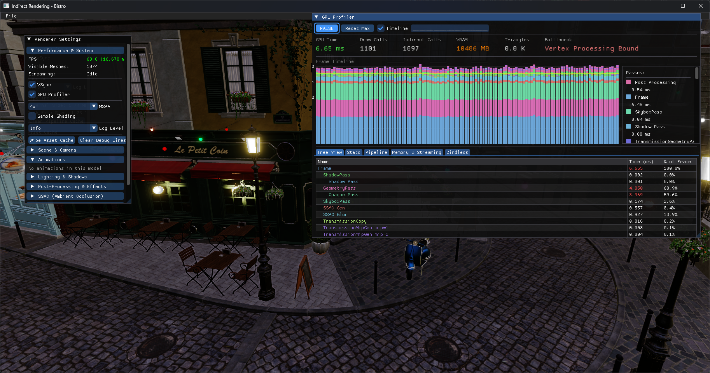

  
JoseJL

  

    <a href="mailto:josejl1987@gmail.com">josejl1987@gmail.com</a>
  

  

    Game engineer and systems programmer. 
    8+ years building healthcare and cloud software, with a focus on rendering, reverse engineering, and tools.
  

  

    <a class="pill" href="https://github.com/josejl1987">GitHub</a>
    <a class="pill" href="#career">Professional Exp.</a>
    <a class="pill" href="#plagueng">plagueng (Contract)</a>
    <a class="pill" href="#geofront">Geofront (Official)</a>
  

<nav class="toc">
  <a href="#plagueng">plagueng (bgfx)</a>
  <a href="#pnkr">pnkr (Vulkan)</a>
  <a href="#glider">Glider, the Folding Hero (UE4)</a>
  <a href="#career">Healthcare Systems (8 Years)</a>
  <a href="#geofront">Geofront — Crossbell Arc</a>
  <a href="#coz">Chaos;Head Noah</a>
  <a href="#brandish2">Brandish 2</a>
  <a href="#ys8">Ys VIII Graphics Mod</a>
</nav>

<section class="project" id="plagueng">
  

    <h2 class="project__title">plagueng — D3D9 Engine Modernization (bgfx)</h2>
    
Role: Contract Engine Programmer (C++ / bgfx)

  

  

    

      

        <strong>Contract work</strong> updating a D3D9-era engine. I separated game logic from rendering and added modern features using the <strong>bgfx</strong> layer.
      

      <ul class="bullets">
        <li><b>bgfx backend:</b> Replaced the fixed-function D3D9 pipeline with a flexible renderer.</li>
        <li><b>PBR support:</b> Added physically based materials and lighting to the legacy engine.</li>
        <li><b>Clustered lighting:</b> Shaders that scale to many dynamic lights.</li>
        <li><b>Terrain tools:</b> GPU-assisted terrain editing workflows.</li>
      </ul>
    

	
      

        
Project Trailer

        

          <iframe
            src="https://www.youtube.com/embed/NkcVND3AKks"
            title="Khosmium alpha teaser"
            frameborder="0"
            allow="accelerometer; autoplay; clipboard-write; encrypted-media; gyroscope; picture-in-picture; web-share"
            allowfullscreen></iframe>
        

      

  

</section>

<section class="project" id="pnkr">
  

    <h2 class="project__title">pnkr_ng — Vulkan Research Engine</h2>
    

        <strong>Status:</strong> Work in Progress / Research Project
         
        <strong>Tech:</strong> Vulkan, C++20, Slang, enkiTS, KTX2
         
        Repository: <a href="https://github.com/josejl1987/pnkr_ng/">github.com/josejl1987/pnkr_ng/</a>
    

  

  

    

      

        A custom rendering framework to study explicit graphics APIs and GPU-driven visibility. The goal is to cut CPU work by moving draw generation and resource binding to the GPU.
      

      

        

          <h3>Core Architecture</h3>
          <ul class="bullets">
            <li><strong>GPU-driven pipeline:</strong> Indirect drawing with frustum culling.</li>
            <li><strong>Frame graph:</strong> Manages transient resources and generates Vulkan barriers and layout transitions.</li>
            <li><strong>Bindless resources:</strong> Descriptor indexing for global shader access to textures and buffers.</li>
          </ul>
        

        

          <h3>Systems & Tooling</h3>
          <ul class="bullets">
            <li><strong>Texture streaming:</strong> Background KTX2 loading with incremental mip exposure and min_lod clamping.</li>
            <li><strong>Memory management:</strong> Linear allocators for per-frame data and VMA for long-term GPU resources.</li>
            <li><strong>Diagnostics:</strong> GPU timeline profiler, BDA auditing for memory faults, and log-level filtering.</li>
            <li><strong>Shader modules:</strong> Slang-based shared structures between C++ and shaders with PBR materials.</li>
          </ul>
        

      

    

    

      <figure>
        
        <figcaption>GPU timeline profiler in pnkr_ng with a Bistro scene capture.</figcaption>
      </figure>
    

  

</section>

<section class="project" id="glider">
  

    <h2 class="project__title">Glider, the Folding Hero — Master's Thesis Project</h2>
    
Role: Programming &amp; Design | Unreal Engine 4

  

  

    

      

        <strong>Final Master's Project (TFM)</strong> for the Master's Degree in Video Game Development at Universidad de Málaga (2015-2016). A three-person team ("12 brujos") built the prototype.
      

      
      <ul class="bullets">
        <li><b>Engine:</b> Built with Unreal Engine 4, combining gameplay systems and rendering features.</li>
        <li><b>Team:</b> Collaborated with Bruno Galán Adega (Art &amp; Design) and Jose Navarrete Vicente (Programming &amp; Design).</li>
        <li><b>Audio Integration:</b> Original soundtrack composed by Oliver Moya.</li>
        <li><b>Academic Recognition:</b> Completed as part of the official <a href="http://mastervideojuegos.uma.es/">Máster Videojuegos UMA</a> program.</li>
      </ul>
      
      

        
Project Trailer

        

          <iframe
            src="https://www.youtube.com/embed/vMcymRMXPms"
            title="Glider, the folding hero (TFM Máster Videojuegos UMA)"
            frameborder="0"
            allow="accelerometer; autoplay; clipboard-write; encrypted-media; gyroscope; picture-in-picture; web-share"
            allowfullscreen></iframe>
        

      

    

  

</section>

<section class="project" id="career">
  

    <h2 class="project__title">Professional Experience — Healthcare Systems</h2>
    
Experience: 8 Years (C# / React / Cloud)

  

  

    

      

        Eight years building reliable software for healthcare systems.
      

      <ul class="bullets">
        <li><b>Medical imaging:</b> Built cloud-based image viewers (C# / React) with low latency.</li>
        <li><b>Scheduling:</b> Designed and maintained large scheduling systems for hospitals.</li>
        <li><b>Full stack:</b> Owned features from backend (C#) through frontend (React).</li>
      </ul>
    

  

</section>

<section class="project" id="geofront">
  

    <h2 class="project__title">Geofront — The Crossbell Arc</h2>
    
Role: Lead Programmer (Reverse Engineering &amp; Systems)

  

  

    

      

        Fan localization engineering work that later became the base for the <strong>official English releases by NIS America.</strong>.
      

      <h3>Trails from Zero / Trails to Azure</h3>
      <ul class="bullets">
        <li><b>Official adoption:</b> Used as the base for commercial PC/Switch releases.</li>
        <li><b>Framerate unlock:</b> Removed 30 fps lock and validated up to 144 fps.</li>
        <li><b>4K support:</b> Arbitrary resolution support with UI scaling.</li>
        <li><b>Text engine:</b> Variable-width fonts</li>
        <li><b>HD assets:</b> Custom texture loading support.</li>
        <li><b>UI/input:</b> Full controller remapping, save menu, and dialogue backlog, and completely revamped ingame settings.</li>
        <li><b>Stability:</b> Resource lifetime fixes and better frame pacing.</li>
      </ul>

      <h3>Dinosaur Resurrection</h3>
      <ul class="bullets">
        <li><b>Framerate unlock:</b> Lifted 30 fps cap to 120 fps.</li>
        <li><b>Text tools:</b> Reverse engineered game script format for text reinsertion.</li>
		<li><b>Text engine:</b> Variable-width fonts</li>
        <li><b>HD support:</b> Allowed upscaling from 640x480 to custom resolution. </li>

      </ul>

      <h3>The Legend of Heroes III: White Witch</h3>
      <ul class="bullets">
        <li><b>SDL3 mapper:</b> DirectDraw and DirectInput to SDL3 compatibility layer.</li>
        <li><b>Text system:</b> Variable-width fonts and reverse engineered game script format for text reinsertion.</li>
        <li><b>Modern systems:</b> Windows 10/11 compatibility and stability fixes.</li>
      </ul>
      
      

        
Feature Showcase

        

          <iframe
            src="https://www.youtube.com/embed/zULIUYoSZRU"
            title="Trails from Zero Feature Demo"
            frameborder="0"
            allow="accelerometer; autoplay; clipboard-write; encrypted-media; gyroscope; picture-in-picture; web-share"
            allowfullscreen></iframe>
        

      

    

    

      <figure>
        
        <figcaption>Reverse engineered Options + Controller mapping UI, including new actions like Message Log.</figcaption>
      </figure>
      <figure>
        
        <figcaption>Dialogue presentation sample.</figcaption>
      </figure>
    

  

</section>

<section class="project" id="coz">
  

    <h2 class="project__title">Committee of Zero — Robotics;Notes Elite / Chaos;Head Noah</h2>
    
Role: Programmer / Hacker (Engine-side patching)

  

  

    

      <ul class="bullets">
        <li><b>Text renderer:</b> Rebuilt typography support (italics, distinct fonts, word wrap)</li>
        <li><b>Censorship restoration:</b> Restored 500+ lines and scenes by re-linking pointers and validating assets</li>
        <li><b>DLC restoration:</b> Recovered DLC content via sprite flags and menu logic rebuild</li>
        <li><b>Cross-platform:</b> Works on Steam, GOG, and Nintendo Switch (via custom firmware)</li>
        <li><b>Runtime patching:</b> Delivered changes via DLL injection without engine source access</li>
        <li><b>Compatibility:</b> Fixes across common PC configurations and locales</li>
      </ul>
    

    

      <figure>
        
        <figcaption>Example "before/after" text improvements (Robotics;Notes Elite).</figcaption>
      </figure>
    

  

</section>

<section class="project" id="brandish2">
  

    <h2 class="project__title">Brandish 2 (PC-98 / DOS)</h2>
    
Role: Programmer (Reverse Engineering + Translation Pipeline)

  

  

    

      <ul class="bullets">
        <li><b>Full disassembly:</b> Reverse engineered the entire PC-98 binary, with the extra challenge of x86 16 bit segmented mode memory constraints.</li>
        <li><b>Custom OMF linker:</b> Built an Object Module Format linker to allow custom code modifications.</li>
      </ul>
    

    

      <figure>
        
        <figcaption>In-game English text on original-style output (CRT capture).</figcaption>
      </figure>
    

  

</section>

<section class="project" id="ys8">
  

    <h2 class="project__title">Ys VIII — DirectX 11 Graphics Mod</h2>
    
Role: Reverse Engineer (Render Pipeline &amp; Shaders)

  

  

    

      

        DirectX 11 graphics mod with real-time controls via an ImGui panel.
      

      <ul class="bullets">
        <li><b>Shadow controls:</b> Custom resolution (512×512 to 16384×16384), 4-level cascades, PCSS </li>
        <li><b>Shader replacement:</b> Switch custom/original shaders in real time.</li>
        <li><b>Graphics pipeline:</b> Render target management, custom cascade bounds, custom FOV.</li>
        <li><b>SMAA:</b> Presets (Low-Ultra), temporal reprojection (T2x), MSAA detection</li>
        <li><b>Multi-pass hooks:</b> SSAO, volume lighting, glare/DOF, blur.</li>
        <li><b>Thread safety:</b> Critical section fixes, fixing random crashes with NVIDIA GPUs on Windows 7.</li>
      </ul>
      
      

        
Repository

        
<a href="https://github.com/josejl1987/YsVIII">github.com/josejl1987/YsVIII</a>

      

    

  

</section>

<section class="project" id="focus">
  

    <h2 class="project__title">Technical focus</h2>
  

  

    

      <ul class="bullets">
        <li><b>Rendering:</b> Vulkan, bgfx, D3D9/11, PBR, GPU-driven rendering.</li>
        <li><b>Systems:</b> Frame pacing, input abstraction, memory management, resource lifetime.</li>
        <li><b>Reverse engineering:</b> Working without source, Ghidra/IDA, binary patching, x86 segmentation.</li>
        <li><b>Tooling:</b> Automation for content-heavy projects, asset extraction/insertion pipelines.</li>
      </ul>
    

    

      

        <b>Note:</b> This page avoids distributing copyrighted game data. Screenshots and clips are shown for demonstration.
      

    

  

</section>
<footer class="site-footer">
  Contact: <a href="mailto:josejl1987@gmail.com">josejl1987@gmail.com</a>
</footer>
