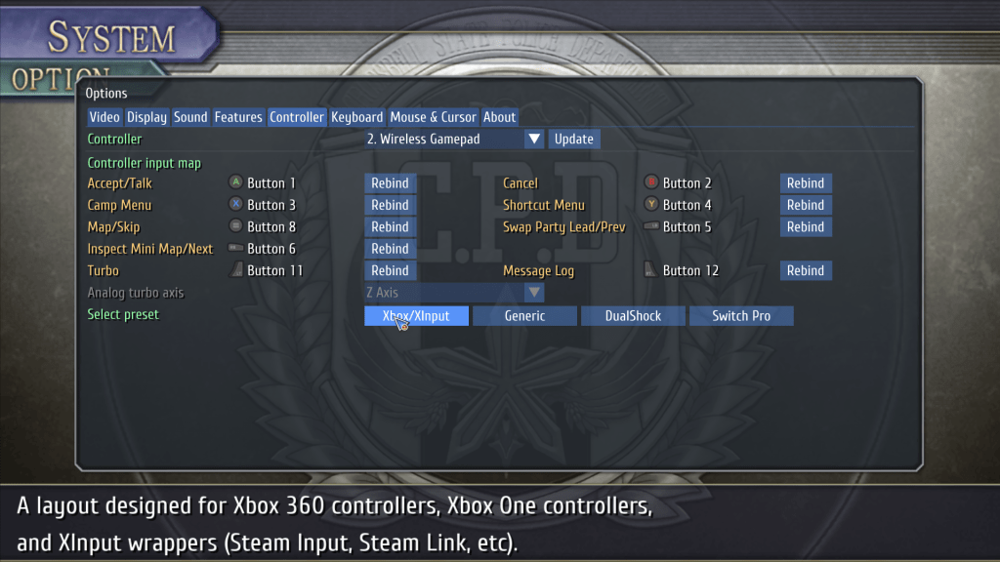
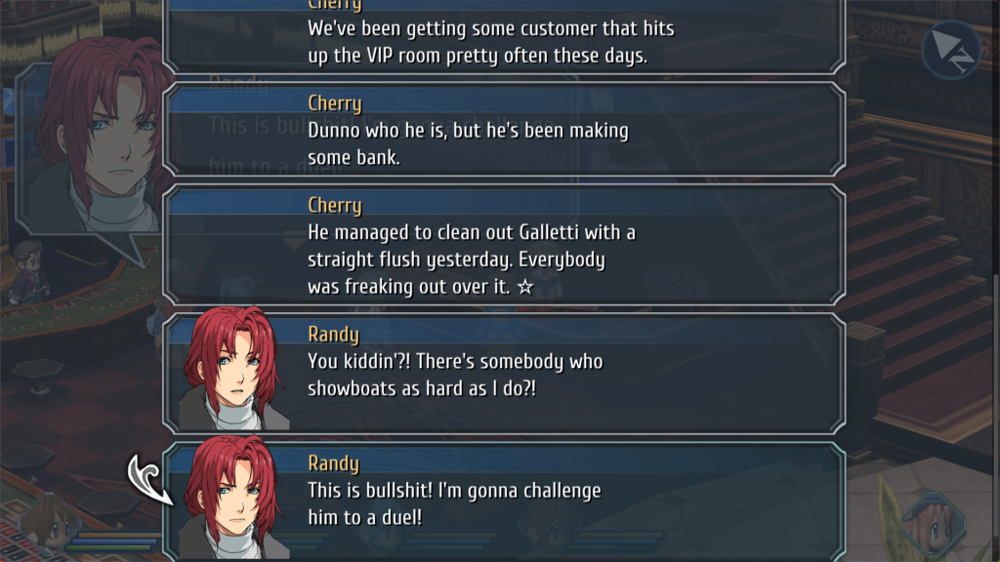
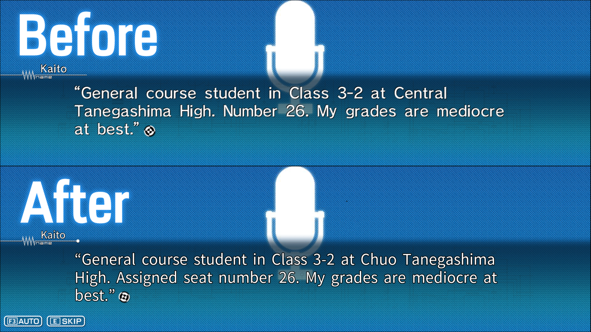
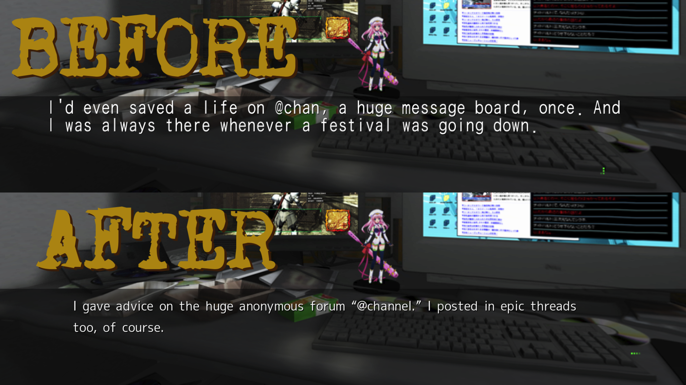

title: JoseJL
---

  
JoseJL

  

    Game development engineering: rendering, systems programming, reverse engineering, and tooling.
  

  

    <a class="pill" href="https://github.com/josejl1987">GitHub</a>
    <a class="pill" href="https://github.com/josejl1987/plagueng">plagueng</a>
    <a class="pill" href="#focus">Technical focus</a>
  

<nav class="toc">
  <a href="#geofront">Geofront</a>
  <a href="#coz">Committee of Zero</a>
  <a href="#brandish2">Brandish 2 (PC-98)</a>
  <a href="#plagueng">plagueng</a>
  <a href="#focus">Technical focus</a>
</nav>

<section class="project" id="geofront">
  

    <h2 class="project__title">Geofront — Trails from Zero / Trails to Azure (PC)</h2>
    

      Role: lead programmer (features, fixes, integration) · Graphics API: <b>Direct3D 9</b>
    

  

  

    

      

        Work delivered as a runtime patch under compatibility constraints (no source access).
        Reverse engineering workflows used <b>IDA</b> and <b>Ghidra</b>, plus runtime inspection/instrumentation for verification and regression control.
      

      <ul class="bullets">
        <li><b>UI / input systems:</b> controller remapping flows; integration of new actions into existing input + UI paths.</li>
        <li><b>Backlog / message log:</b> dialogue history capture and navigation UI integrated with message flow.</li>
        <li><b>Menu and UX work:</b> options/save-related improvements to reduce friction in common workflows.</li>
        <li><b>Frame pacing / high-FPS work:</b> raised framerate cap and checked timing-sensitive behavior at higher refresh rates.</li>
        <li><b>Stability/performance fixes:</b> targeted fixes where long sessions expose resource lifetime issues.</li>
      </ul>
    

    

      <figure>
        
        <figcaption>Options + controller mapping UI, including actions such as Message Log and rebinding support.</figcaption>
      </figure>
      <figure>
        
        <figcaption>Dialogue presentation sample under the patched build.</figcaption>
      </figure>
    

  

</section>

<section class="project" id="coz">
  

    <h2 class="project__title">Committee of Zero — Robotics;Notes Elite / Chaos;Head Noah (PC)</h2>
    

      Role: programmer / hacker (engine-side patching + tooling) · Graphics APIs: <b>Direct3D 9</b> / <b>Direct3D 11</b>
    

  

  

    

      

        Runtime patching and tooling support across multiple PC VN engine variants.
        Reverse engineering workflows used <b>IDA</b> and <b>Ghidra</b>, with changes validated against stability and common regression patterns.
      

      <ul class="bullets">
        <li><b>Runtime patching:</b> changes delivered without engine source access, with packaging and compatibility constraints.</li>
        <li><b>Text/UI behavior fixes:</b> presentation and interaction edge cases; regression handling.</li>
        <li><b>Compatibility:</b> practical fixes across common PC configurations and locales.</li>
        <li><b>Iteration discipline:</b> release workflows built around reproducibility and testing.</li>
      </ul>
    

    

      <figure>
        
        <figcaption>Example “before/after” text improvements (Robotics;Notes Elite).</figcaption>
      </figure>
      <figure>
        
        <figcaption>Example of targeted line revision and terminology cleanup.</figcaption>
      </figure>
    

  

</section>

<section class="project" id="brandish2">
  

    <h2 class="project__title">Brandish 2 (PC-98) — Fan Translation Engineering</h2>
    

      Role: programmer (reverse engineering + translation pipeline support)
    

  

  

    

      

        PC-98-era constraints: tight layout limits, legacy encodings, and pointer-sensitive text storage.
        Work emphasized conservative patching and verification after content expansion.
      

      <ul class="bullets">
        <li><b>Format/layout constraints:</b> text boxes, font constraints, pointer safety, and legacy asset behavior.</li>
        <li><b>Tooling:</b> workflows to extract/insert/verify content changes.</li>
        <li><b>Patch safety:</b> changes designed to avoid late-game regressions under tight constraints.</li>
      </ul>
    

    

      <figure>
        
        <figcaption>In-game English text on original-style output (CRT capture).</figcaption>
      </figure>
    

  

</section>

<section class="project" id="plagueng">
  

    <h2 class="project__title">plagueng — Legacy D3D9 Engine Modernization / Rendering R&amp;D (C++)</h2>
    

      Repository: <a href="https://github.com/josejl1987/plagueng">github.com/josejl1987/plagueng</a> · Rendering layer: <b>bgfx</b>
    

  

  

    

      

        Modernization work evolving a legacy D3D9-era architecture into a codebase suitable for experimenting with modern rendering and tools.
        Focus is on rendering architecture, GPU-driven authoring workflows, and performance-minded iteration.
      

      <ul class="bullets">
        <li><b>PBR pipeline:</b> material parameters + lighting model integration.</li>
        <li><b>Deferred + clustered lighting:</b> frustum/cluster partitioning and light evaluation designed to scale dynamic lights.</li>
        <li><b>Forward path:</b> complementary renderer for comparisons and cases that don’t fit deferred cleanly.</li>
        <li><b>GPU-driven terrain tooling:</b> interactive authoring/painting workflows and GPU-side data flow.</li>
      </ul>

      

        
Latest video (uses plagueng rendering)

        

          <iframe
            src="https://www.youtube.com/embed/zULIUYoSZRU"
            title="plagueng rendering demo"
            frameborder="0"
            allow="accelerometer; autoplay; clipboard-write; encrypted-media; gyroscope; picture-in-picture; web-share"
            allowfullscreen></iframe>
        

      

    

    

      <figure>
        
        <figcaption>Rendering capture from the latest build/video.</figcaption>
      </figure>
    

  

</section>

<section class="project" id="focus">
  

    <h2 class="project__title">Technical focus</h2>
  

  

    

      <ul class="bullets">
        <li><b>Reverse engineering:</b> IDA, Ghidra, runtime inspection; patch safety and regression control.</li>
        <li><b>Graphics APIs:</b> Direct3D 9 (Geofront), Direct3D 9/11 (Committee of Zero), bgfx (plagueng).</li>
        <li><b>Rendering:</b> PBR, forward/deferred variants, clustered lighting, GPU-driven authoring tools.</li>
        <li><b>Systems:</b> frame pacing, UI/input integration, stability work, resource lifetime issues.</li>
        <li><b>Tooling:</b> iteration pipelines, validation, automation for content-heavy projects.</li>
        <li><b>Others:</b> Several years of experience developing enterprise grade cloud based medical imaging visualization in C#</li>
      </ul>
    

    

      

        <b>Note.</b> This page avoids distributing copyrighted game data. Screenshots and clips are shown for demonstration.
      

    

  

</section>
